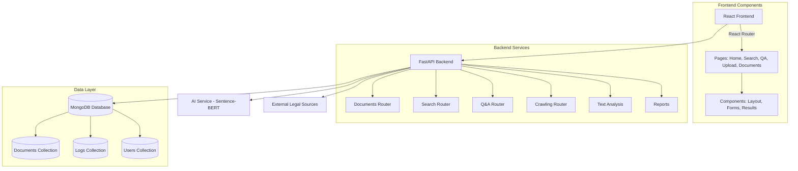
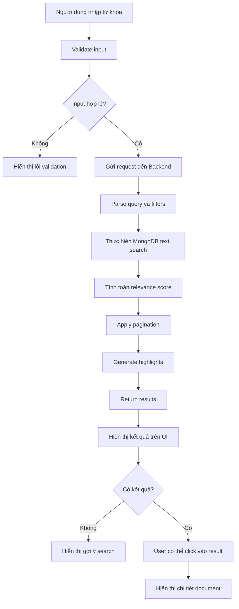
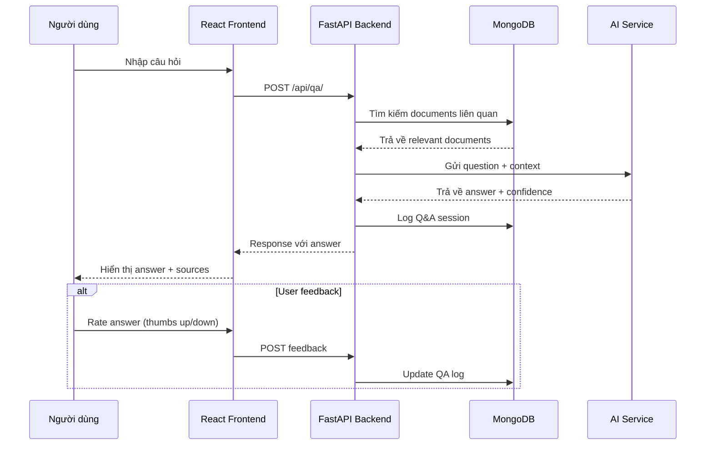
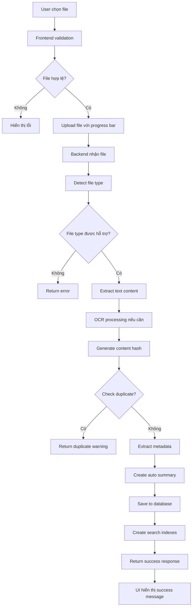
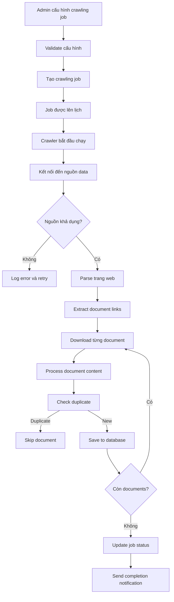
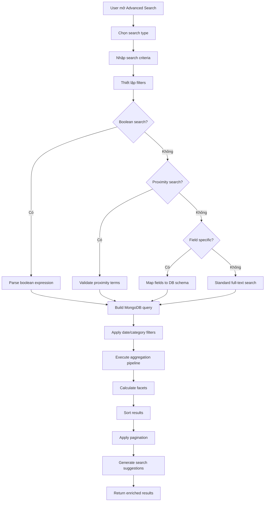
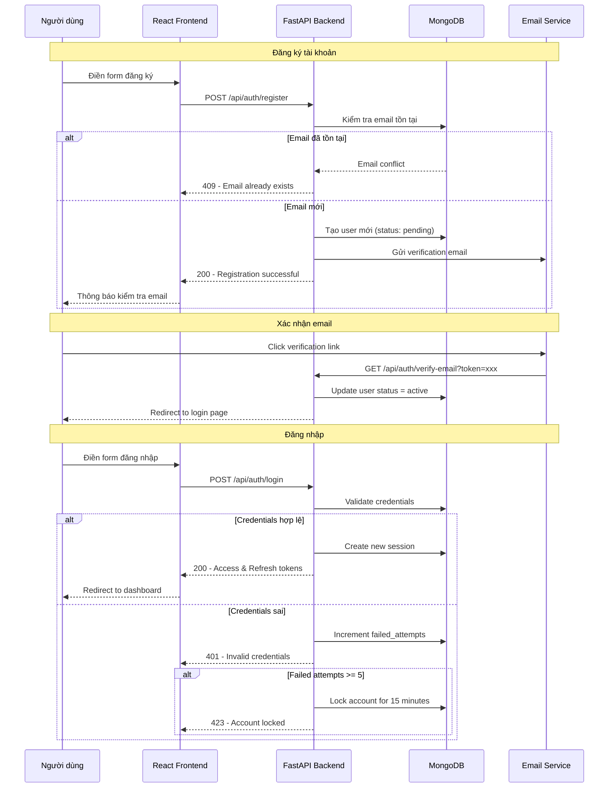

# Tài liệu Hệ thống Tra cứu Văn bản Pháp luật với AI
## Dành cho Business Analyst và Tester

---

## 1. Tổng quan hệ thống

### Mục tiêu của hệ thống
Hệ thống Tra cứu Văn bản Pháp luật với AI là một giải pháp toàn diện để số hóa, quản lý và tra cứu thông minh các văn bản pháp lý. Hệ thống giúp:

- **Số hóa và lưu trữ** văn bản pháp luật từ nhiều nguồn khác nhau
- **Tìm kiếm thông minh** bằng ngôn ngữ tự nhiên với AI
- **Trả lời câu hỏi** tự động dựa trên nội dung văn bản
- **Phân tích và báo cáo** dữ liệu pháp luật
- **Crawling tự động** từ các trang web chính thức

### Kiến trúc hệ thống


**Công nghệ sử dụng:**
- **Backend:** Python + FastAPI + MongoDB + Sentence-BERT cho semantic search
- **Frontend:** React 18 + TypeScript + Material-UI + React Query
- **Database:** MongoDB 7.0+ với full-text search và vector search
- **AI Integration:** Sentence-BERT cho semantic search, LLM cho Q&A

---

## 2. Use Case Diagram

```mermaid
flowchart TD
    User((Người dùng))
    Admin((Quản trị viên))
    System[Hệ thống AI]
    ExternalSources[Nguồn dữ liệu bên ngoài]
    
    User --> UC1[Tìm kiếm văn bản]
    User --> UC2[Hỏi đáp AI]
    User --> UC3[Tải lên văn bản]
    User --> UC4[Xem chi tiết văn bản]
    User --> UC5[Xem lịch sử tìm kiếm]
    
    Admin --> UC6[Quản lý văn bản]
    Admin --> UC7[Crawling tự động]
    Admin --> UC8[Xem báo cáo hệ thống]
    Admin --> UC9[Phân tích văn bản]
    Admin --> UC10[Quản lý người dùng]
    
    System --> UC11[Xử lý ngôn ngữ tự nhiên]
    System --> UC12[Tạo tóm tắt tự động]
    System --> UC13[Phát hiện trùng lặp]
    
    ExternalSources --> UC14[Cung cấp dữ liệu mới]
```



---

## 3. Danh sách Use Case chi tiết

| Use Case ID | Tên Use Case | Actor | Mô tả | Luồng chính | Luồng thay thế | Điều kiện trước | Điều kiện sau |
|-------------|--------------|--------|--------|-------------|----------------|-----------------|---------------|
| UC-01 | Tìm kiếm văn bản cơ bản | Người dùng | Tìm kiếm văn bản pháp luật bằng từ khóa | 1. Nhập từ khóa<br/>2. Chọn danh mục (tuỳ chọn)<br/>3. Nhấn tìm kiếm<br/>4. Xem kết quả | 1a. Không tìm thấy kết quả → Hiện gợi ý<br/>2a. Lỗi hệ thống → Hiện thông báo lỗi | Không có | Danh sách kết quả hiển thị |
| UC-02 | Tìm kiếm nâng cao | Người dùng | Tìm kiếm với nhiều tiêu chí phức tạp | 1. Chọn loại tìm kiếm<br/>2. Nhập điều kiện tìm kiếm<br/>3. Thiết lập bộ lọc<br/>4. Thực hiện tìm kiếm | 1a. Cú pháp không hợp lệ → Hiện thông báo<br/>2a. Quá nhiều kết quả → Phân trang | Người dùng đã biết cú pháp | Kết quả tìm kiếm phù hợp |
| UC-03 | Hỏi đáp AI | Người dùng | Đặt câu hỏi và nhận câu trả lời từ AI | 1. Nhập câu hỏi bằng tiếng Việt<br/>2. Chọn phạm vi tìm kiếm<br/>3. Gửi câu hỏi<br/>4. Nhận câu trả lời kèm nguồn | 1a. Không hiểu câu hỏi → Gợi ý cách hỏi<br/>2a. Không có dữ liệu → Thông báo không tìm thấy | AI service khả dụng | Câu trả lời với độ tin cậy |
| UC-04 | Tải lên văn bản | Người dùng | Upload file văn bản để số hóa | 1. Chọn file (PDF, DOC, TXT)<br/>2. Nhập thông tin metadata<br/>3. Tải lên<br/>4. Hệ thống xử lý và lưu trữ | 1a. File không hỗ trợ → Thông báo lỗi<br/>2a. Phát hiện trùng lặp → Xác nhận ghi đè | File hợp lệ | Văn bản được số hóa và lưu trữ |
| UC-05 | Xem chi tiết văn bản | Người dùng | Xem toàn bộ nội dung và metadata văn bản | 1. Chọn văn bản từ kết quả tìm kiếm<br/>2. Xem nội dung đầy đủ<br/>3. Xem thông tin metadata<br/>4. Có thể export hoặc in | 1a. Văn bản không tồn tại → Thông báo lỗi | Văn bản tồn tại trong hệ thống | Nội dung văn bản hiển thị đầy đủ |
| UC-06 | Crawling tự động | Quản trị viên | Thu thập văn bản từ các nguồn chính thức | 1. Cấu hình nguồn crawling<br/>2. Thiết lập lịch trình<br/>3. Bắt đầu crawling<br/>4. Giám sát tiến trình | 1a. Nguồn không khả dụng → Thử lại sau<br/>2a. Lỗi mạng → Tạm dừng và báo cáo | Nguồn dữ liệu khả dụng | Dữ liệu mới được thu thập |
| UC-07 | Phân tích văn bản | Quản trị viên | Thực hiện các phân tích nâng cao | 1. Chọn loại phân tích<br/>2. Chọn văn bản/dataset<br/>3. Cấu hình tham số<br/>4. Chạy phân tích<br/>5. Xem kết quả | 1a. Dataset quá lớn → Phân tích từng phần<br/>2a. Lỗi phân tích → Ghi log và thông báo | Dữ liệu đủ để phân tích | Báo cáo phân tích được tạo |
| UC-08 | Xem báo cáo dashboard | Quản trị viên | Theo dõi hiệu suất và sử dụng hệ thống | 1. Truy cập dashboard<br/>2. Chọn khoảng thời gian<br/>3. Xem các metric<br/>4. Export báo cáo | 1a. Không có dữ liệu → Hiện thông báo<br/>2a. Lỗi truy vấn → Refresh trang | Quyền admin | Dashboard hiển thị đầy đủ |
| UC-09 | Đăng ký tài khoản | Người dùng mới | Tạo tài khoản để sử dụng hệ thống | 1. Truy cập trang đăng ký<br/>2. Nhập thông tin cá nhân<br/>3. Nhập email và mật khẩu<br/>4. Xác nhận đăng ký<br/>5. Kích hoạt qua email | 1a. Email đã tồn tại → Thông báo lỗi<br/>2a. Mật khẩu không đủ mạnh → Yêu cầu thay đổi<br/>3a. Email không hợp lệ → Thông báo lỗi | Không có tài khoản | Tài khoản được tạo và kích hoạt |
| UC-10 | Đăng nhập hệ thống | Người dùng | Xác thực và truy cập vào hệ thống | 1. Truy cập trang đăng nhập<br/>2. Nhập email/username<br/>3. Nhập mật khẩu<br/>4. Nhấn đăng nhập<br/>5. Được chuyển đến trang chính | 1a. Thông tin sai → Thông báo lỗi<br/>2a. Tài khoản bị khóa → Thông báo<br/>3a. Quên mật khẩu → Chuyển đến reset password | Có tài khoản hợp lệ | Được xác thực và truy cập hệ thống |
| UC-11 | Đăng xuất khỏi hệ thống | Người dùng đã đăng nhập | Kết thúc phiên làm việc | 1. Nhấn nút đăng xuất<br/>2. Xác nhận đăng xuất<br/>3. Xóa session/token<br/>4. Chuyển về trang chủ | 1a. Session hết hạn → Tự động đăng xuất | Đã đăng nhập | Session được xóa và đăng xuất |
| UC-12 | Quản lý hồ sơ cá nhân | Người dùng đã đăng nhập | Xem và chỉnh sửa thông tin cá nhân | 1. Truy cập trang hồ sơ<br/>2. Xem thông tin hiện tại<br/>3. Chỉnh sửa thông tin<br/>4. Lưu thay đổi | 1a. Validation lỗi → Hiện thông báo<br/>2a. Email mới đã tồn tại → Thông báo | Đã đăng nhập | Thông tin được cập nhật |
| UC-13 | Đổi mật khẩu | Người dùng đã đăng nhập | Thay đổi mật khẩu tài khoản | 1. Truy cập trang đổi mật khẩu<br/>2. Nhập mật khẩu hiện tại<br/>3. Nhập mật khẩu mới<br/>4. Xác nhận mật khẩu mới<br/>5. Lưu thay đổi | 1a. Mật khẩu cũ sai → Thông báo lỗi<br/>2a. Mật khẩu mới không đủ mạnh → Yêu cầu thay đổi | Đã đăng nhập | Mật khẩu được thay đổi |
| UC-14 | Quên mật khẩu | Người dùng | Khôi phục mật khẩu khi quên | 1. Nhấn "Quên mật khẩu"<br/>2. Nhập email<br/>3. Nhận email reset<br/>4. Click link trong email<br/>5. Nhập mật khẩu mới | 1a. Email không tồn tại → Thông báo<br/>2a. Link hết hạn → Yêu cầu tạo mới | Có tài khoản với email hợp lệ | Mật khẩu được reset thành công |

---

## 4. API Documentation

### 4.1 Documents API

#### POST /api/documents/
**Mô tả:** Tạo văn bản mới
**Request Body:**
```json
{
  "title": "Nghị định về thuế thu nhập cá nhân",
  "content": "Nội dung chi tiết của nghị định...",
  "summary": "Quy định về thuế TNCN cho cá nhân",
  "category": "Luật Thuế",
  "tags": ["thuế", "cá nhân", "nghị định"],
  "metadata": {
    "document_number": "10/2020/NĐ-CP",
    "issue_date": "2020-01-15",
    "effective_date": "2020-03-01"
  }
}
```
**Response:**
```json
{
  "id": "507f1f77bcf86cd799439011",
  "title": "Nghị định về thuế thu nhập cá nhân",
  "category": "Luật Thuế",
  "date_created": "2024-01-15T08:30:00Z",
  "status": "active"
}
```

#### POST /api/documents/upload
**Mô tả:** Upload file văn bản
**Request:** Multipart form data
- `file`: File đính kèm (PDF, DOC, TXT)
- `title`: Tiêu đề văn bản
- `category`: Danh mục
- `tags`: Tags (phân cách bằng dấu phẩy)

**Response:**
```json
{
  "id": "507f1f77bcf86cd799439012",
  "title": "Luật Đầu tư 2020",
  "file_path": "/uploads/luat-dau-tu-2020.pdf",
  "file_size": 2048576,
  "processing_status": "completed"
}
```

#### GET /api/documents/
**Mô tả:** Lấy danh sách văn bản
**Query Parameters:**
- `skip`: Số bản ghi bỏ qua (default: 0)
- `limit`: Số bản ghi trả về (default: 10, max: 100)
- `category`: Lọc theo danh mục

**Response:**
```json
[
  {
    "id": "507f1f77bcf86cd799439011",
    "title": "Nghị định về thuế thu nhập cá nhân",
    "summary": "Quy định về thuế TNCN cho cá nhân",
    "category": "Luật Thuế",
    "date_created": "2024-01-15T08:30:00Z"
  }
]
```

### 4.2 Search API

#### POST /api/search/
**Mô tả:** Tìm kiếm văn bản cơ bản
**Request Body:**
```json
{
  "query": "thuế thu nhập cá nhân",
  "category": "Luật Thuế",
  "tags": ["thuế"],
  "limit": 20,
  "offset": 0
}
```
**Response:**
```json
{
  "results": [
    {
      "document": {
        "id": "507f1f77bcf86cd799439011",
        "title": "Nghị định về thuế thu nhập cá nhân",
        "summary": "Quy định về thuế TNCN..."
      },
      "score": 0.95,
      "highlights": [
        "Quy định về <em>thuế thu nhập cá nhân</em> trong trường hợp..."
      ]
    }
  ],
  "total_count": 15,
  "query": "thuế thu nhập cá nhân",
  "execution_time": 0.234
}
```

#### POST /api/advanced-search/
**Mô tả:** Tìm kiếm nâng cao với nhiều loại
**Request Body:**
```json
{
  "query": "thuế AND (cá nhân OR doanh nghiệp)",
  "search_type": "boolean",
  "filters": {
    "date_range": {
      "start": "2020-01-01",
      "end": "2024-12-31"
    },
    "category": ["Luật Thuế", "Nghị định"]
  },
  "sort_by": "relevance",
  "limit": 20,
  "offset": 0
}
```

### 4.3 Q&A API

#### POST /api/qa/
**Mô tả:** Hỏi đáp với AI
**Request Body:**
```json
{
  "question": "Thuế suất thuế thu nhập cá nhân năm 2024 là bao nhiêu?",
  "context_limit": 5,
  "category": "Luật Thuế"
}
```
**Response:**
```json
{
  "question": "Thuế suất thuế thu nhập cá nhân năm 2024 là bao nhiêu?",
  "answer": "Theo Nghị định 65/2013/NĐ-CP, thuế suất thuế thu nhập cá nhân được quy định theo bảng lũy tiến từ 5% đến 35% tuỳ thuộc vào mức thu nhập...",
  "confidence": 0.92,
  "sources": [
    {
      "id": "507f1f77bcf86cd799439011",
      "title": "Nghị định 65/2013/NĐ-CP",
      "relevance": 0.95
    }
  ],
  "execution_time": 1.23
}
```

### 4.4 Crawling API

#### POST /api/crawling/documents
**Mô tả:** Bắt đầu crawling từ nguồn chỉ định
**Request Body:**
```json
{
  "sources": ["vanban.chinhphu.vn"],
  "category": "Nghị định",
  "start_date": "2024-01-01",
  "end_date": "2024-12-31",
  "limit": 100
}
```
**Response:**
```json
{
  "documents_found": 45,
  "documents_saved": 42,
  "sources_crawled": ["vanban.chinhphu.vn"],
  "execution_time": 125.6,
  "status": "completed"
}
```

### 4.5 Reports API

#### GET /api/reports/dashboard/overview
**Mô tả:** Tổng quan dashboard
**Response:**
```json
{
  "total_documents": 15420,
  "recent_documents": 156,
  "search_analytics": {
    "total_searches_7days": 2340,
    "popular_queries": [
      {"query": "thuế", "count": 145},
      {"query": "lao động", "count": 89}
    ]
  },
  "top_categories": [
    {"category": "Luật Thuế", "count": 2341},
    {"category": "Luật Lao động", "count": 1876}
  ]
}
```

### 4.6 Authentication API

#### POST /api/auth/register
**Mô tả:** Đăng ký tài khoản người dùng mới
**Request Body:**
```json
{
  "username": "nguyenvana",
  "email": "nguyenvana@email.com",
  "password": "MySecureP@ssw0rd",
  "full_name": "Nguyễn Văn A",
  "phone": "0901234567",
  "organization": "Công ty ABC"
}
```
**Response:**
```json
{
  "id": "507f1f77bcf86cd799439015",
  "username": "nguyenvana",
  "email": "nguyenvana@email.com",
  "full_name": "Nguyễn Văn A",
  "status": "pending_verification",
  "created_at": "2024-01-15T08:30:00Z",
  "message": "Tài khoản được tạo thành công. Vui lòng kiểm tra email để kích hoạt."
}
```

#### POST /api/auth/login
**Mô tả:** Đăng nhập vào hệ thống
**Request Body:**
```json
{
  "email": "nguyenvana@email.com",
  "password": "MySecureP@ssw0rd"
}
```
**Response:**
```json
{
  "access_token": "eyJ0eXAiOiJKV1QiLCJhbGciOiJIUzI1NiJ9...",
  "refresh_token": "eyJ0eXAiOiJKV1QiLCJhbGciOiJIUzI1NiJ9...",
  "token_type": "bearer",
  "expires_in": 3600,
  "user": {
    "id": "507f1f77bcf86cd799439015",
    "username": "nguyenvana",
    "email": "nguyenvana@email.com",
    "full_name": "Nguyễn Văn A",
    "role": "user",
    "last_login": "2024-01-15T08:30:00Z"
  }
}
```

#### POST /api/auth/logout
**Mô tả:** Đăng xuất khỏi hệ thống
**Headers:** `Authorization: Bearer <access_token>`
**Response:**
```json
{
  "message": "Đăng xuất thành công",
  "logged_out_at": "2024-01-15T09:30:00Z"
}
```

#### POST /api/auth/refresh
**Mô tả:** Làm mới access token
**Request Body:**
```json
{
  "refresh_token": "eyJ0eXAiOiJKV1QiLCJhbGciOiJIUzI1NiJ9..."
}
```
**Response:**
```json
{
  "access_token": "eyJ0eXAiOiJKV1QiLCJhbGciOiJIUzI1NiJ9...",
  "token_type": "bearer",
  "expires_in": 3600
}
```

#### GET /api/auth/me
**Mô tả:** Lấy thông tin người dùng hiện tại
**Headers:** `Authorization: Bearer <access_token>`
**Response:**
```json
{
  "id": "507f1f77bcf86cd799439015",
  "username": "nguyenvana",
  "email": "nguyenvana@email.com",
  "full_name": "Nguyễn Văn A",
  "phone": "0901234567",
  "organization": "Công ty ABC",
  "role": "user",
  "status": "active",
  "created_at": "2024-01-15T08:30:00Z",
  "last_login": "2024-01-15T08:30:00Z",
  "preferences": {
    "language": "vi",
    "notifications_enabled": true
  }
}
```

#### PUT /api/auth/me
**Mô tả:** Cập nhật thông tin cá nhân
**Headers:** `Authorization: Bearer <access_token>`
**Request Body:**
```json
{
  "full_name": "Nguyễn Văn A (Cập nhật)",
  "phone": "0901234568",
  "organization": "Công ty XYZ",
  "preferences": {
    "language": "vi",
    "notifications_enabled": false
  }
}
```
**Response:**
```json
{
  "id": "507f1f77bcf86cd799439015",
  "message": "Cập nhật thông tin thành công",
  "updated_fields": ["full_name", "phone", "organization", "preferences"],
  "updated_at": "2024-01-15T09:45:00Z"
}
```

#### POST /api/auth/change-password
**Mô tả:** Thay đổi mật khẩu
**Headers:** `Authorization: Bearer <access_token>`
**Request Body:**
```json
{
  "current_password": "MySecureP@ssw0rd",
  "new_password": "NewSecureP@ssw0rd123"
}
```
**Response:**
```json
{
  "message": "Thay đổi mật khẩu thành công",
  "changed_at": "2024-01-15T10:00:00Z"
}
```

#### POST /api/auth/forgot-password
**Mô tả:** Yêu cầu reset mật khẩu
**Request Body:**
```json
{
  "email": "nguyenvana@email.com"
}
```
**Response:**
```json
{
  "message": "Email reset mật khẩu đã được gửi",
  "expires_in": 1800,
  "sent_at": "2024-01-15T10:15:00Z"
}
```

#### POST /api/auth/reset-password
**Mô tả:** Reset mật khẩu với token
**Request Body:**
```json
{
  "token": "abc123xyz789resettoken",
  "new_password": "NewSecureP@ssw0rd123"
}
```
**Response:**
```json
{
  "message": "Reset mật khẩu thành công",
  "reset_at": "2024-01-15T10:30:00Z"
}
```

#### POST /api/auth/verify-email
**Mô tả:** Xác nhận email kích hoạt tài khoản
**Request Body:**
```json
{
  "token": "abc123xyz789verifytoken"
}
```
**Response:**
```json
{
  "message": "Tài khoản đã được kích hoạt thành công",
  "user_id": "507f1f77bcf86cd799439015",
  "verified_at": "2024-01-15T10:45:00Z"
}
```

---

## 5. Data Structure / Database Collections

### 5.1 Documents Collection
```javascript
{
  "_id": ObjectId,
  "title": String,                    // Tiêu đề văn bản
  "content": String,                  // Nội dung đầy đủ
  "summary": String,                  // Tóm tắt tự động
  "category": String,                 // Danh mục (Luật, Nghị định, Thông tư, ...)
  "tags": [String],                   // Tags để phân loại
  "date_created": DateTime,           // Ngày tạo
  "date_updated": DateTime,           // Ngày cập nhật cuối
  "file_path": String,                // Đường dẫn file gốc
  "file_size": Number,                // Kích thước file (bytes)
  "file_type": String,                // Loại file (pdf, docx, txt)
  "metadata": {
    "document_number": String,        // Số văn bản (VD: 10/2020/NĐ-CP)
    "issue_date": DateTime,           // Ngày ban hành
    "effective_date": DateTime,       // Ngày có hiệu lực
    "expiry_date": DateTime,          // Ngày hết hiệu lực
    "issuing_agency": String,         // Cơ quan ban hành
    "signer": String,                 // Người ký
    "subject": String,                // Về việc...
    "language": String,               // Ngôn ngữ (vi, en)
    "status": String                  // Trạng thái (active, superseded, draft)
  },
  "processing_info": {
    "content_hash": String,           // Hash của nội dung để detect duplicate
    "extracted_entities": [String],   // Thực thể được trích xuất
    "legal_citations": [String],      // Các trích dẫn pháp lý
    "structure": Object,              // Cấu trúc văn bản (chương, điều, khoản)
    "ocr_confidence": Number          // Độ tin cậy OCR (0-1)
  }
}
```

**Indexes:**
```javascript
// Text search index
{ "title": "text", "content": "text", "summary": "text" }
// Category index
{ "category": 1 }
// Date indexes
{ "date_created": -1 }
{ "metadata.issue_date": -1 }
// Tags index
{ "tags": 1 }
// Content hash for duplicate detection
{ "processing_info.content_hash": 1 }
```

### 5.2 Search_Logs Collection
```javascript
{
  "_id": ObjectId,
  "user_id": String,                  // ID người dùng (nếu có)
  "query": String,                    // Câu truy vấn
  "search_type": String,              // Loại tìm kiếm (basic, advanced, semantic)
  "filters": Object,                  // Bộ lọc áp dụng
  "results_count": Number,            // Số kết quả trả về
  "execution_time": Number,           // Thời gian thực hiện (ms)
  "timestamp": DateTime,              // Thời điểm tìm kiếm
  "user_agent": String,               // Thông tin trình duyệt
  "ip_address": String                // Địa chỉ IP
}
```

### 5.3 QA_Logs Collection
```javascript
{
  "_id": ObjectId,
  "user_id": String,
  "question": String,                 // Câu hỏi
  "answer": String,                   // Câu trả lời
  "confidence": Number,               // Độ tin cậy (0-1)
  "source_documents": [ObjectId],     // Các văn bản nguồn
  "processing_time": Number,          // Thời gian xử lý (ms)
  "feedback": {                       // Phản hồi từ người dùng
    "rating": Number,                 // Đánh giá (1-5)
    "helpful": Boolean,               // Có hữu ích không
    "comment": String                 // Bình luận
  },
  "timestamp": DateTime
}
```

### 5.4 Crawling_Jobs Collection
```javascript
{
  "_id": ObjectId,
  "job_name": String,                 // Tên job
  "source": String,                   // Nguồn crawl
  "status": String,                   // running, completed, failed, stopped
  "config": {
    "start_date": DateTime,
    "end_date": DateTime,
    "categories": [String],
    "max_documents": Number
  },
  "results": {
    "documents_found": Number,
    "documents_saved": Number,
    "documents_duplicated": Number,
    "documents_failed": Number,
    "errors": [String]
  },
  "started_at": DateTime,
  "completed_at": DateTime,
  "next_run": DateTime                // Cho scheduled jobs
}
```

### 5.5 Users Collection
```javascript
{
  "_id": ObjectId,
  "username": String,                 // Tên đăng nhập duy nhất
  "email": String,                    // Email (duy nhất)
  "password_hash": String,            // Mật khẩu đã hash (bcrypt)
  "full_name": String,                // Họ và tên đầy đủ
  "phone": String,                    // Số điện thoại
  "organization": String,             // Tổ chức/công ty
  "role": String,                     // Vai trò (user, admin, moderator)
  "status": String,                   // Trạng thái (active, inactive, suspended, pending_verification)
  "avatar_url": String,               // URL ảnh đại diện
  "date_created": DateTime,           // Ngày tạo tài khoản
  "date_updated": DateTime,           // Ngày cập nhật cuối
  "last_login": DateTime,             // Lần đăng nhập cuối
  "login_count": Number,              // Số lần đăng nhập
  "email_verified": Boolean,          // Email đã xác nhận chưa
  "email_verified_at": DateTime,      // Thời điểm xác nhận email
  "preferences": {
    "language": String,               // Ngôn ngữ (vi, en)
    "timezone": String,               // Múi giờ
    "notifications_enabled": Boolean, // Bật thông báo
    "theme": String,                  // Giao diện (light, dark)
    "results_per_page": Number        // Số kết quả mỗi trang
  },
  "security": {
    "two_factor_enabled": Boolean,    // Bật 2FA
    "password_changed_at": DateTime,  // Lần đổi mật khẩu cuối
    "failed_login_attempts": Number,  // Số lần đăng nhập thất bại
    "locked_until": DateTime,         // Khóa tài khoản đến khi nào
    "reset_password_token": String,   // Token reset password
    "reset_password_expires": DateTime, // Hết hạn token reset
    "email_verification_token": String, // Token xác nhận email
    "email_verification_expires": DateTime // Hết hạn token xác nhận
  },
  "activity": {
    "total_searches": Number,         // Tổng số lần tìm kiếm
    "total_questions": Number,        // Tổng số câu hỏi AI
    "total_uploads": Number,          // Tổng số file upload
    "last_search": DateTime,          // Lần tìm kiếm cuối
    "last_question": DateTime,        // Lần hỏi AI cuối
    "favorite_categories": [String]   // Danh mục yêu thích
  }
}
```

**Indexes:**
```javascript
// Unique indexes
{ "username": 1, "unique": true }
{ "email": 1, "unique": true }
// Authentication indexes
{ "email": 1, "status": 1 }
{ "username": 1, "status": 1 }
// Security indexes
{ "security.reset_password_token": 1 }
{ "security.email_verification_token": 1 }
// Activity indexes
{ "last_login": -1 }
{ "date_created": -1 }
// Role and status indexes
{ "role": 1 }
{ "status": 1 }
```

### 5.6 User_Sessions Collection (cho JWT blacklist và session management)
```javascript
{
  "_id": ObjectId,
  "user_id": ObjectId,               // Reference đến Users collection
  "session_id": String,              // UUID cho session
  "access_token_jti": String,        // JWT ID của access token
  "refresh_token_jti": String,       // JWT ID của refresh token
  "device_info": {
    "user_agent": String,            // Thông tin trình duyệt
    "ip_address": String,            // Địa chỉ IP
    "device_type": String,           // mobile, desktop, tablet
    "os": String,                    // Hệ điều hành
    "browser": String                // Trình duyệt
  },
  "created_at": DateTime,            // Thời điểm tạo session
  "expires_at": DateTime,            // Thời điểm hết hạn
  "last_activity": DateTime,         // Hoạt động cuối
  "is_active": Boolean,              // Session còn hoạt động
  "logout_at": DateTime,             // Thời điểm đăng xuất
  "logout_reason": String            // Lý do đăng xuất (manual, expired, security)
}
```

**Indexes:**
```javascript
// User sessions
{ "user_id": 1, "is_active": 1 }
{ "session_id": 1, "unique": true }
// Token management
{ "access_token_jti": 1 }
{ "refresh_token_jti": 1 }
// Cleanup expired sessions
{ "expires_at": 1 }
{ "created_at": -1 }
```

### 5.7 Search_Analytics Collection (cho search behavior tracking và optimization)
```javascript
{
  "_id": ObjectId,
  "user_id": String,                  // ID người dùng (nếu có)
  "session_id": String,               // Session ID để track user session
  "query": String,                    // Câu truy vấn gốc
  "normalized_query": String,         // Query sau khi normalize
  "search_type": String,              // basic, advanced, boolean, proximity, phrase
  "filters_applied": {
    "category": [String],             // Categories được filter
    "date_range": {
      "start": DateTime,
      "end": DateTime
    },
    "document_type": [String],
    "issuing_agency": [String]
  },
  "results_metadata": {
    "total_count": Number,            // Tổng số kết quả
    "returned_count": Number,         // Số kết quả trả về
    "top_score": Number,              // Điểm cao nhất
    "avg_score": Number,              // Điểm trung bình
    "has_suggestions": Boolean        // Có gợi ý hay không
  },
  "performance_metrics": {
    "execution_time": Number,         // Thời gian thực hiện (ms)
    "index_usage": [String],          // Indexes được sử dụng
    "query_plan_hash": String         // Hash của query plan
  },
  "user_interaction": {
    "clicked_results": [Number],      // Vị trí results được click
    "time_spent": Number,             // Thời gian xem kết quả (ms)
    "refined_query": String,          // Query tiếp theo nếu có
    "exported_results": Boolean       // Có export kết quả không
  },
  "timestamp": DateTime,              // Thời điểm search
  "ip_address": String,               // Địa chỉ IP
  "user_agent": String,               // Thông tin browser
  "geo_location": {                   // Vị trí địa lý (nếu có)
    "country": String,
    "city": String,
    "region": String
  }
}
```

**Indexes:**
```javascript
// Time-based queries for analytics
{ "timestamp": -1 }
{ "user_id": 1, "timestamp": -1 }
// Query analysis
{ "normalized_query": 1 }
{ "search_type": 1, "timestamp": -1 }
// Performance monitoring
{ "performance_metrics.execution_time": -1 }
// User behavior analysis
{ "user_id": 1, "user_interaction.clicked_results": 1 }
```

### 5.8 System_Metrics Collection (cho system performance monitoring)
```javascript
{
  "_id": ObjectId,
  "metric_type": String,              // database, api, search, ai, crawling
  "timestamp": DateTime,              // Thời điểm đo
  "time_window": String,              // 1min, 5min, 15min, 1hour, 1day
  "database_metrics": {
    "connection_pool": {
      "total_connections": Number,
      "active_connections": Number,
      "idle_connections": Number
    },
    "query_performance": {
      "avg_query_time": Number,       // ms
      "slow_queries_count": Number,   // queries > 1000ms
      "total_queries": Number
    },
    "index_usage": {
      "index_hits": Number,
      "collection_scans": Number,
      "index_efficiency": Number      // ratio
    }
  },
  "api_metrics": {
    "request_count": Number,
    "avg_response_time": Number,      // ms
    "error_rate": Number,             // percentage
    "status_codes": {
      "2xx": Number,
      "4xx": Number,
      "5xx": Number
    },
    "endpoint_performance": [{
      "endpoint": String,
      "count": Number,
      "avg_time": Number
    }]
  },
  "search_metrics": {
    "total_searches": Number,
    "avg_search_time": Number,        // ms
    "zero_result_rate": Number,       // percentage
    "popular_queries": [{
      "query": String,
      "count": Number
    }]
  },
  "ai_metrics": {
    "total_questions": Number,
    "avg_processing_time": Number,    // ms
    "avg_confidence": Number,         // 0-1
    "success_rate": Number            // percentage
  },
  "system_resources": {
    "cpu_usage": Number,              // percentage
    "memory_usage": Number,           // MB
    "disk_usage": Number,             // percentage
    "network_io": Number              // MB/s
  }
}
```

**Indexes:**
```javascript
// Time-series data
{ "timestamp": -1, "metric_type": 1 }
{ "time_window": 1, "timestamp": -1 }
// Performance monitoring
{ "api_metrics.avg_response_time": -1 }
{ "search_metrics.avg_search_time": -1 }
```

### 5.9 Document_Processing_Jobs Collection (cho batch processing và background jobs)
```javascript
{
  "_id": ObjectId,
  "job_type": String,                 // upload_processing, batch_analysis, index_rebuild, cleanup
  "job_name": String,                 // Tên mô tả job
  "status": String,                   // pending, running, completed, failed, cancelled
  "priority": Number,                 // 1 (highest) to 10 (lowest)
  "created_by": String,               // User ID tạo job
  "created_at": DateTime,
  "started_at": DateTime,
  "completed_at": DateTime,
  "scheduled_for": DateTime,          // Cho scheduled jobs
  "config": {
    "source_path": String,            // Đường dẫn file/folder nguồn
    "target_collection": String,      // Collection đích
    "processing_options": {
      "extract_metadata": Boolean,
      "detect_duplicates": Boolean,
      "create_summary": Boolean,
      "ocr_enabled": Boolean,
      "auto_categorize": Boolean
    },
    "filters": Object,                // Bộ lọc processing
    "batch_size": Number              // Số documents/batch
  },
  "progress": {
    "total_items": Number,            // Tổng số items cần xử lý
    "processed_items": Number,        // Số items đã xử lý
    "failed_items": Number,           // Số items thất bại
    "success_items": Number,          // Số items thành công
    "current_item": String,           // Item hiện tại đang xử lý
    "percentage": Number              // Phần trăm hoàn thành (0-100)
  },
  "results": {
    "documents_created": [ObjectId],  // IDs của documents được tạo
    "documents_updated": [ObjectId],  // IDs của documents được cập nhật
    "documents_failed": [{
      "document_id": String,
      "error": String,
      "timestamp": DateTime
    }],
    "processing_summary": {
      "total_size": Number,           // Tổng kích thước xử lý (bytes)
      "avg_processing_time": Number, // Thời gian xử lý trung bình/item (ms)
      "duplicates_found": Number,
      "new_categories": [String]
    }
  },
  "error_details": {
    "error_message": String,
    "error_stack": String,
    "failed_at": DateTime,
    "retry_count": Number,
    "max_retries": Number
  },
  "logs": [{
    "timestamp": DateTime,
    "level": String,                  // info, warning, error
    "message": String,
    "details": Object
  }]
}
```

**Indexes:**
```javascript
// Job management
{ "status": 1, "created_at": -1 }
{ "job_type": 1, "status": 1 }
{ "created_by": 1, "created_at": -1 }
// Scheduling
{ "scheduled_for": 1, "status": 1 }
{ "priority": 1, "created_at": -1 }
// Performance monitoring
{ "completed_at": -1 }
```

### 5.10 Text_Analysis_Cache Collection (cho caching analysis results)
```javascript
{
  "_id": ObjectId,
  "cache_key": String,                // Unique cache key (hash of parameters)
  "analysis_type": String,            // keyword_extraction, sentiment_analysis, entity_recognition, similarity_matrix
  "input_hash": String,               // Hash của input data
  "parameters": {
    "document_ids": [ObjectId],       // Documents được phân tích
    "category": String,
    "date_range": {
      "start": DateTime,
      "end": DateTime
    },
    "analysis_options": Object        // Các tùy chọn phân tích
  },
  "results": {
    "keywords": [{
      "term": String,
      "frequency": Number,
      "tfidf_score": Number,
      "importance": Number
    }],
    "entities": [{
      "text": String,
      "label": String,                // PERSON, ORG, LAW, DATE, etc.
      "confidence": Number,
      "start_pos": Number,
      "end_pos": Number
    }],
    "sentiment": {
      "overall_score": Number,        // -1 to 1
      "positive": Number,
      "negative": Number,
      "neutral": Number
    },
    "topics": [{
      "topic_id": Number,
      "words": [String],
      "weight": Number
    }],
    "similarities": [{
      "document_id": ObjectId,
      "similarity_score": Number,
      "common_terms": [String]
    }]
  },
  "metadata": {
    "created_at": DateTime,
    "expires_at": DateTime,           // Cache expiration
    "access_count": Number,           // Số lần cache được sử dụng
    "last_accessed": DateTime,
    "computation_time": Number,       // Thời gian tính toán (ms)
    "result_size": Number             // Kích thước result (bytes)
  }
}
```

**Indexes:**
```javascript
// Cache lookup
{ "cache_key": 1, "unique": true }
{ "input_hash": 1 }
// Cache management
{ "expires_at": 1 }
{ "last_accessed": 1 }
{ "analysis_type": 1, "created_at": -1 }
```

---

## 6. Test Scenario / Test Case cho Tester

### 6.1 Functional Test Cases

| Test ID | Chức năng | Tiền điều kiện | Bước thực hiện | Kết quả mong đợi |
|---------|-----------|----------------|----------------|------------------|
| TC-DOC-001 | Tạo văn bản mới | - API khả dụng<br/>- DB kết nối thành công | 1. POST /api/documents/ với data hợp lệ<br/>2. Kiểm tra response | - Status: 200<br/>- Document ID được trả về<br/>- Data lưu vào DB |
| TC-DOC-002 | Validation tạo văn bản | - API khả dụng | 1. POST /api/documents/ với title rỗng<br/>2. Kiểm tra response | - Status: 422<br/>- Error message về validation |
| TC-DOC-003 | Upload file PDF | - File PDF hợp lệ | 1. POST /api/documents/upload<br/>2. Đính kèm file PDF | - Status: 200<br/>- File được xử lý<br/>- Content được extract |
| TC-DOC-004 | Upload file không hỗ trợ | - File .exe | 1. POST /api/documents/upload<br/>2. Đính kèm file .exe | - Status: 400<br/>- Error về file type |
| TC-SEARCH-001 | Tìm kiếm cơ bản | - Có ít nhất 1 document | 1. POST /api/search/<br/>2. Query = "thuế" | - Status: 200<br/>- Results array không rỗng<br/>- Score > 0 |
| TC-SEARCH-002 | Tìm kiếm không có kết quả | - API khả dụng | 1. POST /api/search/<br/>2. Query = "xyz123notfound" | - Status: 200<br/>- Results array rỗng<br/>- Total_count = 0 |
| TC-SEARCH-003 | Tìm kiếm với filter | - Có documents nhiều category | 1. POST /api/search/<br/>2. Query = "luật"<br/>3. Category = "Luật Thuế" | - Status: 200<br/>- Chỉ trả về docs có category = "Luật Thuế" |
| TC-QA-001 | Hỏi đáp AI cơ bản | - AI service khả dụng<br/>- Có document liên quan | 1. POST /api/qa/<br/>2. Question = "Thuế TNCN là gì?" | - Status: 200<br/>- Answer không rỗng<br/>- Confidence > 0.5<br/>- Sources có ít nhất 1 item |
| TC-QA-002 | Hỏi đáp câu hỏi không liên quan | - AI service khả dụng | 1. POST /api/qa/<br/>2. Question = "Thời tiết hôm nay thế nào?" | - Status: 200<br/>- Answer thông báo không tìm thấy<br/>- Confidence thấp |
| TC-CRAWL-001 | Khởi tạo crawling job | - External source khả dụng | 1. POST /api/crawling/documents<br/>2. Source hợp lệ | - Status: 200<br/>- Job được tạo<br/>- Documents được crawl |
| TC-AUTH-001 | Đăng ký tài khoản thành công | - API khả dụng<br/>- Email chưa tồn tại | 1. POST /api/auth/register với data hợp lệ<br/>2. Kiểm tra response<br/>3. Kiểm tra email verification | - Status: 200<br/>- User ID được trả về<br/>- Email verification được gửi |
| TC-AUTH-002 | Đăng ký với email đã tồn tại | - Email đã có trong DB | 1. POST /api/auth/register với email trùng<br/>2. Kiểm tra response | - Status: 409<br/>- Error message về email conflict |
| TC-AUTH-003 | Validation đăng ký | - API khả dụng | 1. POST /api/auth/register với password yếu<br/>2. Kiểm tra response | - Status: 422<br/>- Error về password policy |
| TC-AUTH-004 | Đăng nhập thành công | - User đã đăng ký và kích hoạt | 1. POST /api/auth/login với credentials đúng<br/>2. Kiểm tra response | - Status: 200<br/>- Access token và refresh token<br/>- User info được trả về |
| TC-AUTH-005 | Đăng nhập sai thông tin | - User tồn tại | 1. POST /api/auth/login với password sai<br/>2. Kiểm tra response | - Status: 401<br/>- Error message về credentials |
| TC-AUTH-006 | Đăng nhập với tài khoản chưa kích hoạt | - User chưa verify email | 1. POST /api/auth/login<br/>2. Kiểm tra response | - Status: 403<br/>- Error về account not verified |
| TC-AUTH-007 | Refresh token | - Có refresh token hợp lệ | 1. POST /api/auth/refresh với refresh token<br/>2. Kiểm tra response | - Status: 200<br/>- Access token mới |
| TC-AUTH-008 | Lấy thông tin user | - Access token hợp lệ | 1. GET /api/auth/me với Authorization header<br/>2. Kiểm tra response | - Status: 200<br/>- User info đầy đủ |
| TC-AUTH-009 | Cập nhật hồ sơ | - User đã đăng nhập | 1. PUT /api/auth/me với data mới<br/>2. Kiểm tra response | - Status: 200<br/>- Thông tin được cập nhật |
| TC-AUTH-010 | Đổi mật khẩu thành công | - User đã đăng nhập | 1. POST /api/auth/change-password<br/>2. Current password đúng<br/>3. New password hợp lệ | - Status: 200<br/>- Password được thay đổi |
| TC-AUTH-011 | Đổi mật khẩu sai current password | - User đã đăng nhập | 1. POST /api/auth/change-password<br/>2. Current password sai | - Status: 400<br/>- Error về current password |
| TC-AUTH-012 | Quên mật khẩu | - User tồn tại | 1. POST /api/auth/forgot-password với email<br/>2. Kiểm tra response | - Status: 200<br/>- Reset email được gửi |
| TC-AUTH-013 | Reset mật khẩu | - Có reset token hợp lệ | 1. POST /api/auth/reset-password<br/>2. Token và password mới | - Status: 200<br/>- Password được reset |
| TC-AUTH-014 | Xác nhận email | - Có verification token | 1. POST /api/auth/verify-email với token<br/>2. Kiểm tra response | - Status: 200<br/>- Account được kích hoạt |
| TC-AUTH-015 | Đăng xuất | - User đã đăng nhập | 1. POST /api/auth/logout<br/>2. Kiểm tra response | - Status: 200<br/>- Token bị blacklist |
| TC-AUTH-016 | Access với token đã logout | - Token đã bị blacklist | 1. GET /api/auth/me với token cũ<br/>2. Kiểm tra response | - Status: 401<br/>- Token invalid |
| TC-AUTH-017 | Khóa tài khoản sau failed login | - User tồn tại | 1. Đăng nhập sai 5 lần liên tiếp<br/>2. Thử đăng nhập lần 6 | - Status: 423<br/>- Account temporarily locked |

### 6.2 Performance Test Cases

| Test ID | Chức năng | Điều kiện | Tiêu chí đánh giá | Kết quả mong đợi |
|---------|-----------|-----------|-------------------|------------------|
| PT-SEARCH-001 | Tìm kiếm đơn giản | 1000 concurrent users | Response time < 2s | 95% requests < 2s |
| PT-SEARCH-002 | Tìm kiếm phức tạp | 100 concurrent users | Response time < 5s | 95% requests < 5s |
| PT-QA-001 | Hỏi đáp AI | 50 concurrent users | Response time < 10s | 95% requests < 10s |
| PT-UPLOAD-001 | Upload file 10MB | 10 concurrent uploads | Upload time < 30s | 100% uploads successful |

### 6.3 Security Test Cases

| Test ID | Chức năng | Mô tả test | Kết quả mong đợi |
|---------|-----------|------------|------------------|
| SEC-001 | SQL Injection | Gửi special characters trong search query | Query được escape, không crash |
| SEC-002 | File Upload Security | Upload file .php, .js với code | File bị reject hoặc content bị sanitize |
| SEC-003 | XSS Protection | Inject script trong document content | Script được escape khi hiển thị |
| SEC-004 | Rate Limiting | Gửi 1000 requests trong 1 phút | Bị rate limit sau threshold |
| SEC-AUTH-001 | JWT Token Manipulation | Modify JWT payload và signature | Token bị reject, return 401 |
| SEC-AUTH-002 | Expired Token Access | Sử dụng token đã hết hạn | Return 401 với token expired message |
| SEC-AUTH-003 | Password Brute Force | Thử nhiều password liên tiếp | Account bị lock sau 5 attempts |
| SEC-AUTH-004 | Weak Password Policy | Đăng ký với password yếu | Reject với error về password strength |
| SEC-AUTH-005 | Session Hijacking | Sử dụng session ID của user khác | Access denied, invalid session |
| SEC-AUTH-006 | CSRF Protection | Cross-site request forgery attack | Request bị block bởi CSRF token |
| SEC-AUTH-007 | Privilege Escalation | User thường truy cập admin API | Return 403 Forbidden |
| SEC-AUTH-008 | Token Reuse After Logout | Sử dụng access token sau logout | Return 401, token in blacklist |

### 6.4 Integration Test Cases

| Test ID | Chức năng | Mô tả test | Kết quả mong đợi |
|---------|-----------|------------|------------------|
| INT-001 | Frontend-Backend | Test API calls từ React app | Tất cả endpoints hoạt động |
| INT-002 | Database Connection | Test kết nối MongoDB | Connection pool hoạt động ổn định |
| INT-003 | AI Service Integration | Test calls tới AI service | Responses hợp lệ với timeout handling |
| INT-004 | External Crawling | Test crawl từ external sites | Data được fetch và parse đúng |

---

## 7. Flow Chart và Sequence Diagram

### 7.1 Document Search Flow


### 7.2 Q&A Process Sequence Diagram


### 7.3 Document Upload and Processing Flow


### 7.4 Crawling Process Flow


### 7.5 Advanced Search with Filters


### 7.6 User Authentication Flow


### 7.7 Password Reset Flow
```mermaid
flowchart TD
    A[User click "Forgot Password"] --> B[Nhập email]
    B --> C[POST /api/auth/forgot-password]
    C --> D{Email tồn tại?}
    D -->|Không| E[Return success (security)]
    D -->|Có| F[Generate reset token]
    F --> G[Save token with expiry 30min]
    G --> H[Gửi reset email]
    H --> I[User nhận email]
    I --> J[Click reset link]
    J --> K[Mở form reset password]
    K --> L[Nhập mật khẩu mới]
    L --> M[POST /api/auth/reset-password]
    M --> N{Token hợp lệ?}
    N -->|Không| O[Error: Token invalid/expired]
    N -->|Có| P[Hash password mới]
    P --> Q[Cập nhật trong DB]
    Q --> R[Xóa reset token]
    R --> S[Thông báo thành công]
    S --> T[Redirect to login]
```

### 7.8 Session Management Flow
```mermaid
flowchart TD
    A[User đăng nhập] --> B[Tạo Access Token (15min)]
    B --> C[Tạo Refresh Token (7 days)]
    C --> D[Lưu session info vào DB]
    D --> E[Trả về tokens cho client]
    E --> F[Client lưu tokens]
    F --> G[Client gọi API với Access Token]
    G --> H{Token còn hợp lệ?}
    H -->|Có| I[Xử lý request]
    H -->|Hết hạn| J[Return 401]
    J --> K[Client gọi /api/auth/refresh]
    K --> L{Refresh Token hợp lệ?}
    L -->|Có| M[Tạo Access Token mới]
    L -->|Không| N[Redirect to login]
    M --> O[Trả về Access Token mới]
    O --> G
    
    P[User đăng xuất] --> Q[Gọi /api/auth/logout]
    Q --> R[Blacklist current tokens]
    R --> S[Cập nhật session status]
    S --> T[Redirect to homepage]
```

---

## 8. Ghi chú bổ sung

### Các điểm cần lưu ý cho Business Analyst:
1. **Multilingual Support**: Hệ thống được tối ưu cho tiếng Việt nhưng có thể mở rộng cho nhiều ngôn ngữ
2. **Scalability**: Kiến trúc cho phép scale horizontal với MongoDB sharding
3. **AI Integration**: Có thể tích hợp thêm các AI models khác (Gemini Pro, Claude) cho Q&A
4. **Mobile Responsive**: Frontend được thiết kế responsive cho mobile
5. **Offline Capability**: Có thể phát triển PWA cho chức năng offline
6. **User Authentication**: Hệ thống hỗ trợ đăng ký, đăng nhập với JWT và email verification
7. **Role-based Access**: Phân quyền theo vai trò (user, admin, moderator)
8. **Session Management**: Quản lý session đa thiết bị với khả năng logout từ xa

### Các điểm cần lưu ý cho Tester:
1. **Test Data**: Cần chuẩn bị dataset đa dạng với các loại văn bản khác nhau
2. **Performance Baseline**: Thiết lập baseline performance trước khi test
3. **Error Handling**: Đặc biệt chú ý test error scenarios và edge cases
4. **Cross-browser Testing**: Test trên Chrome, Firefox, Safari, Edge
5. **API Rate Limiting**: Test rate limiting để đảm bảo system stability
6. **Authentication Testing**: Test đầy đủ authentication flow, session management
7. **Security Testing**: Test JWT token handling, password policies, XSS, CSRF
8. **Authorization Testing**: Verify role-based access control

### Security Considerations:
1. **Password Security**:
   - Mật khẩu được hash bằng bcrypt với cost factor >= 12
   - Yêu cầu mật khẩu mạnh: ít nhất 8 ký tự, có chữ hoa, chữ thường, số và ký tự đặc biệt
   - Khóa tài khoản sau 5 lần đăng nhập thất bại trong 15 phút

2. **JWT Token Security**:
   - Access token có thời hạn ngắn (15 phút - 1 giờ)
   - Refresh token có thời hạn dài hơn (7-30 ngày)
   - Implement token blacklist khi logout
   - Sử dụng secure, httpOnly cookies cho refresh token

3. **Session Management**:
   - Track multiple device sessions
   - Ability to logout from all devices
   - Session timeout after inactivity
   - Device fingerprinting for suspicious login detection

4. **Email Security**:
   - Email verification required for new accounts
   - Password reset tokens expire after 30 minutes
   - Rate limit password reset requests

5. **API Security**:
   - Rate limiting per IP and per user
   - CORS configuration
   - Input validation and sanitization
   - SQL injection prevention (MongoDB)
   - XSS prevention in responses

### Môi trường Test:
- **Development**: Localhost với sample data
- **Staging**: Môi trường gần giống production
- **Production**: Môi trường thực với data thực

### Tools đề xuất:
- **API Testing**: Postman, Newman
- **Performance Testing**: JMeter, Artillery  
- **UI Testing**: Cypress, Selenium
- **Database Testing**: MongoDB Compass, Robo 3T

---

## 9. MongoDB Implementation & Advanced Techniques

Hệ thống sử dụng MongoDB với các kỹ thuật nâng cao để đảm bảo hiệu suất, khả năng mở rộng và tính nhất quán dữ liệu. Dưới đây là phân tích chi tiết các kỹ thuật MongoDB được triển khai:

### 9.1 MongoDB Architecture Overview

**Database Structure:**
- **Số lượng collections**: 6+ collections chính (documents, search_logs, qa_logs, crawling_jobs, users, user_sessions)
- **Data modeling**: Hybrid approach kết hợp embedded documents và references
- **Connection**: Hỗ trợ cả MongoDB Atlas (cloud) và local MongoDB
- **Async Driver**: Sử dụng Motor cho async operations với FastAPI

### 9.2 Full-Text Search với Vietnamese Language

**Mô tả:**
- Sử dụng MongoDB Text Index với weighted search để tối ưu tìm kiếm tiếng Việt
- Cấu hình weights: title (10), summary (5), metadata.subject (3), content (1)  
- Hỗ trợ text search operators và meta score sorting
- Tự động generate highlights cho matching terms trong kết quả

**Áp dụng trong:** API `/api/search/` - Tìm kiếm cơ bản với text score ranking

**Benefit:** Tìm kiếm ngữ nghĩa tốt hơn regex, performance cao với large datasets, built-in relevance scoring

### 9.3 Aggregation Pipeline cho Advanced Search  

**Mô tả:**
- Kết hợp multiple stages: `$match`, `$facet`, `$group`, `$project` trong single query
- Faceted search: Đếm documents theo category, document_type, issuing_agency song song
- Multi-condition filtering với logical operators (AND/OR)
- Pipeline optimization với index usage và memory efficient processing

**Áp dụng trong:** API `/api/advanced-search/` - Complex queries với filters và facets

**Benefit:** Giảm số round-trips đến database, xử lý complex logic phía database, memory efficient

### 9.4 Compound Indexes cho Performance

**Mô tả:**  
- Tạo compound indexes cho multiple fields: `(category, date_created)`, `(tags, category)`
- Index cho metadata fields: `document_type`, `issuing_agency`, `issue_date`, `effective_date`
- Content hash index cho duplicate detection
- Text index kết hợp với compound indexes cho optimal query performance

**Áp dụng trong:** Tất cả search operations, filtering, và sorting queries

**Benefit:** Query execution time giảm từ seconds xuống milliseconds, hỗ trợ covered queries

### 9.5 $facet cho Multi-Pipeline Aggregation

**Mô tả:**
- Chạy nhiều aggregation pipelines song song trong một query duy nhất
- Tính toán statistics: total documents, category breakdown, recent documents cùng lúc
- Kết hợp với `$group` để generate analytics reports hiệu quả
- Memory optimization với proper pipeline ordering

**Áp dụng trong:** API `/api/reports/dashboard/overview` - Dashboard analytics và reporting

**Benefit:** Giảm database round-trips, consistent data snapshot, improved response time

### 9.6 Boolean Search với Query Parsing

**Mô tả:**
- Parse boolean expressions với AND, OR, NOT operators  
- Convert boolean logic thành MongoDB query structures
- Hỗ trợ parentheses grouping và operator precedence
- Custom scoring algorithm cho boolean search results

**Áp dụng trong:** API `/api/advanced-search/` với search_type="boolean"

**Benefit:** Flexible query expressions, precise search control, legal document specific search patterns

### 9.7 Proximity Search với Regex Patterns

**Mô tả:**
- Tìm kiếm terms xuất hiện trong khoảng cách xác định (word distance)
- Generate regex patterns cho proximity matching
- Custom scoring dựa trên distance giữa terms
- Optimized highlight generation cho proximity results

**Áp dụng trong:** API `/api/advanced-search/` với search_type="proximity" 

**Benefit:** Contextual search trong legal documents, find related concepts, better semantic matching

### 9.8 Content Hash cho Duplicate Detection

**Mô tả:**
- Tạo SHA-256 hash của document content khi upload
- Unique index trên `processing_info.content_hash` field
- Tự động detect và prevent duplicate documents
- Conflict resolution options: update existing hoặc skip duplicate

**Áp dụng trong:** API `/api/documents/upload` - File upload validation và processing

**Benefit:** Đảm bảo data integrity, tiết kiệm storage space, maintain data quality

### 9.9 Search Analytics với Time-series Data

**Mô tả:**
- Log search queries với timestamp, execution time, result counts
- Group search data theo time periods (day, week, month)
- Aggregate popular queries, filter usage patterns, performance metrics
- Trend analysis và search behavior insights

**Áp dụng trong:** Search logging và API `/api/reports/search-analytics`

**Benefit:** Business intelligence, system optimization insights, user behavior analysis

### 9.10 Aggregation với $group và $project Optimization

**Mô tả:**
- Strategic use của `$group` để calculate counts, averages, min/max values
- `$project` để limit returned fields và reduce data transfer
- Pipeline stage ordering để optimize performance 
- Memory-efficient processing với allowDiskUse cho large datasets

**Áp dụng trong:** Tất cả reporting APIs - document statistics, usage metrics, compliance tracking

**Benefit:** Reduced network traffic, server-side processing, scalable analytics

### 9.11 Date Range Queries với Index Optimization

**Mô tả:**
- Efficient date range filtering với `$gte`, `$lte` operators
- Indexes trên date fields: `date_created`, `issue_date`, `effective_date`
- Time-based aggregations cho trend analysis
- Timezone handling cho accurate date comparisons

**Áp dụng trong:** Document filtering, time-based reports, compliance tracking

**Benefit:** Fast date-based queries, accurate temporal analysis, timezone consistency

### 9.12 Pagination với skip/limit và Cursor-based Optimization

**Mô tả:**
- Traditional pagination với `skip()` và `limit()` methods
- Optimization để avoid large skip values với range-based queries
- Total count calculation với `$facet` để avoid double queries  
- Cursor-based pagination cho large datasets performance

**Áp dụng trong:** Tất cả list APIs - documents list, search results, user management

**Benefit:** Consistent performance cho large datasets, reduced server load, better user experience

### 9.13 Connection Pool Management

**Mô tả:**
- AsyncIOMotorClient với optimized connection pool settings
- MongoDB Atlas connection với SSL/TLS configuration
- Connection timeout và retry logic cho stability
- Separate sync/async clients cho different use cases

**Áp dụng trong:** Database connection layer, background tasks, API requests

**Benefit:** Connection reuse efficiency, fault tolerance, scalable concurrent connections

### 9.14 Data Validation với Pydantic Integration

**Mô tả:**
- Pydantic models với MongoDB ObjectId handling
- Automatic conversion methods: `to_mongo()`, `from_mongo()`
- Type validation và serialization consistency
- JSON encoder configuration cho ObjectId và datetime fields

**Áp dụng trong:** Tất cả data operations, API request/response handling

**Benefit:** Type safety, automatic validation, consistent data formats, reduced bugs

---

*Tài liệu này được tạo dựa trên phân tích code và kiến trúc hệ thống. Vui lòng cập nhật khi có thay đổi trong requirements hoặc implementation.*