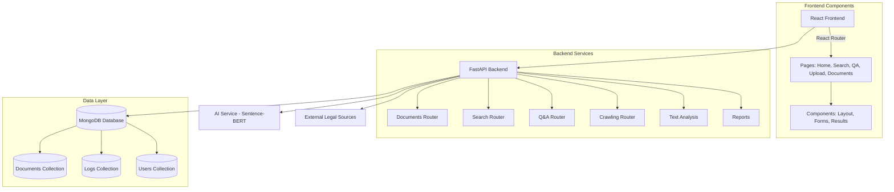
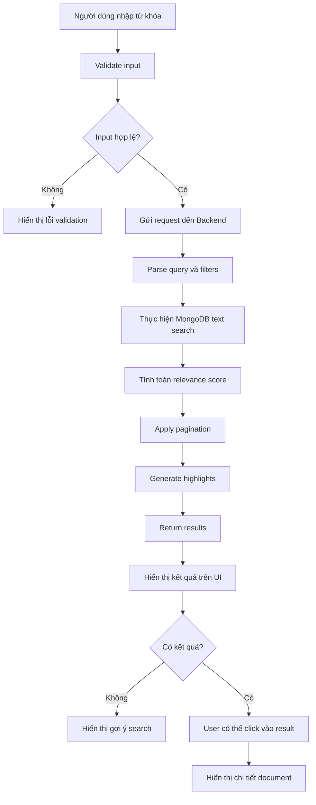
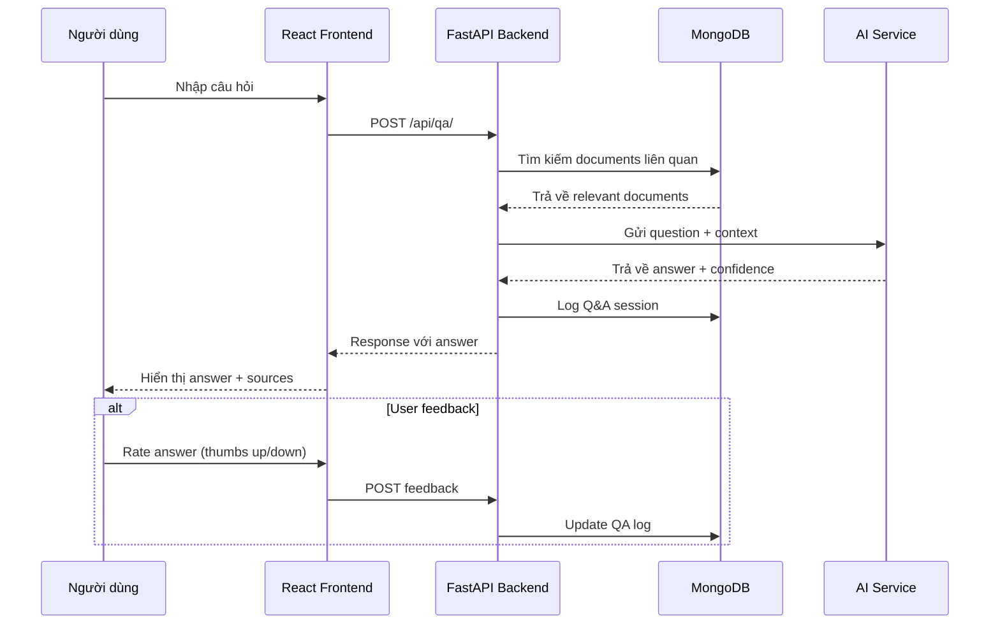
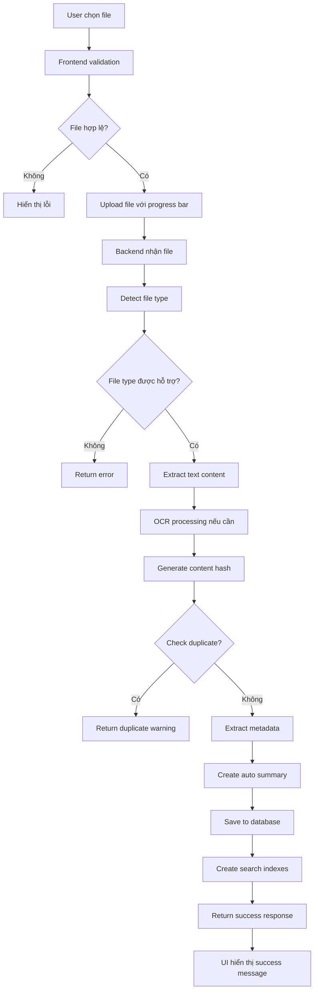
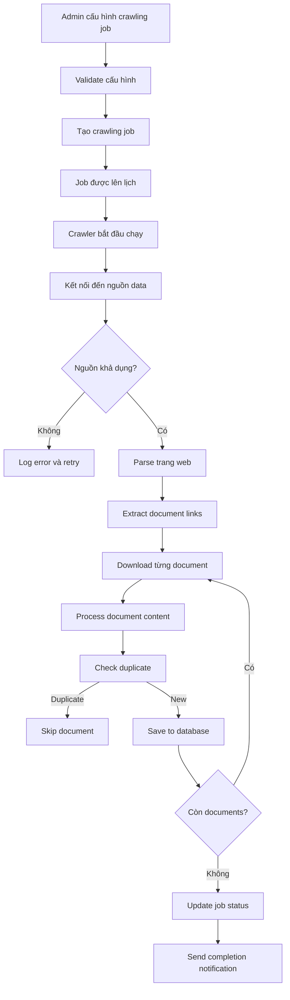
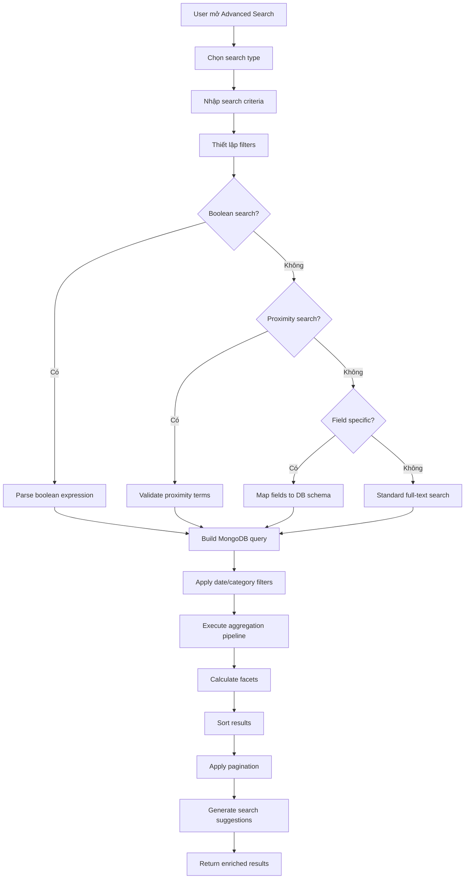

# Tài liệu Hệ thống Tra cứu Văn bản Pháp luật với AI
## Dành cho Business Analyst và Tester

---

## 1. Tổng quan hệ thống

### Mục tiêu của hệ thống
Hệ thống Tra cứu Văn bản Pháp luật với AI là một giải pháp toàn diện để số hóa, quản lý và tra cứu thông minh các văn bản pháp lý. Hệ thống giúp:

- **Số hóa và lưu trữ** văn bản pháp luật từ nhiều nguồn khác nhau
- **Tìm kiếm thông minh** bằng ngôn ngữ tự nhiên với AI
- **Trả lời câu hỏi** tự động dựa trên nội dung văn bản
- **Phân tích và báo cáo** dữ liệu pháp luật
- **Crawling tự động** từ các trang web chính thức

### Kiến trúc hệ thống


**Công nghệ sử dụng:**
- **Backend:** Python + FastAPI + MongoDB + Sentence-BERT cho semantic search
- **Frontend:** React 18 + TypeScript + Material-UI + React Query
- **Database:** MongoDB 7.0+ với full-text search và vector search
- **AI Integration:** Sentence-BERT cho semantic search, LLM cho Q&A

---

## 2. Use Case Diagram

```mermaid
flowchart TD
    User((Người dùng))
    Admin((Quản trị viên))
    System[Hệ thống AI]
    ExternalSources[Nguồn dữ liệu bên ngoài]
    
    User --> UC1[Tìm kiếm văn bản]
    User --> UC2[Hỏi đáp AI]
    User --> UC3[Tải lên văn bản]
    User --> UC4[Xem chi tiết văn bản]
    User --> UC5[Xem lịch sử tìm kiếm]
    
    Admin --> UC6[Quản lý văn bản]
    Admin --> UC7[Crawling tự động]
    Admin --> UC8[Xem báo cáo hệ thống]
    Admin --> UC9[Phân tích văn bản]
    Admin --> UC10[Quản lý người dùng]
    
    System --> UC11[Xử lý ngôn ngữ tự nhiên]
    System --> UC12[Tạo tóm tắt tự động]
    System --> UC13[Phát hiện trùng lặp]
    
    ExternalSources --> UC14[Cung cấp dữ liệu mới]
```



---

## 3. Danh sách Use Case chi tiết

| Use Case ID | Tên Use Case | Actor | Mô tả | Luồng chính | Luồng thay thế | Điều kiện trước | Điều kiện sau |
|-------------|--------------|--------|--------|-------------|----------------|-----------------|---------------|
| UC-01 | Tìm kiếm văn bản cơ bản | Người dùng | Tìm kiếm văn bản pháp luật bằng từ khóa | 1. Nhập từ khóa<br/>2. Chọn danh mục (tuỳ chọn)<br/>3. Nhấn tìm kiếm<br/>4. Xem kết quả | 1a. Không tìm thấy kết quả → Hiện gợi ý<br/>2a. Lỗi hệ thống → Hiện thông báo lỗi | Không có | Danh sách kết quả hiển thị |
| UC-02 | Tìm kiếm nâng cao | Người dùng | Tìm kiếm với nhiều tiêu chí phức tạp | 1. Chọn loại tìm kiếm<br/>2. Nhập điều kiện tìm kiếm<br/>3. Thiết lập bộ lọc<br/>4. Thực hiện tìm kiếm | 1a. Cú pháp không hợp lệ → Hiện thông báo<br/>2a. Quá nhiều kết quả → Phân trang | Người dùng đã biết cú pháp | Kết quả tìm kiếm phù hợp |
| UC-03 | Hỏi đáp AI | Người dùng | Đặt câu hỏi và nhận câu trả lời từ AI | 1. Nhập câu hỏi bằng tiếng Việt<br/>2. Chọn phạm vi tìm kiếm<br/>3. Gửi câu hỏi<br/>4. Nhận câu trả lời kèm nguồn | 1a. Không hiểu câu hỏi → Gợi ý cách hỏi<br/>2a. Không có dữ liệu → Thông báo không tìm thấy | AI service khả dụng | Câu trả lời với độ tin cậy |
| UC-04 | Tải lên văn bản | Người dùng | Upload file văn bản để số hóa | 1. Chọn file (PDF, DOC, TXT)<br/>2. Nhập thông tin metadata<br/>3. Tải lên<br/>4. Hệ thống xử lý và lưu trữ | 1a. File không hỗ trợ → Thông báo lỗi<br/>2a. Phát hiện trùng lặp → Xác nhận ghi đè | File hợp lệ | Văn bản được số hóa và lưu trữ |
| UC-05 | Xem chi tiết văn bản | Người dùng | Xem toàn bộ nội dung và metadata văn bản | 1. Chọn văn bản từ kết quả tìm kiếm<br/>2. Xem nội dung đầy đủ<br/>3. Xem thông tin metadata<br/>4. Có thể export hoặc in | 1a. Văn bản không tồn tại → Thông báo lỗi | Văn bản tồn tại trong hệ thống | Nội dung văn bản hiển thị đầy đủ |
| UC-06 | Crawling tự động | Quản trị viên | Thu thập văn bản từ các nguồn chính thức | 1. Cấu hình nguồn crawling<br/>2. Thiết lập lịch trình<br/>3. Bắt đầu crawling<br/>4. Giám sát tiến trình | 1a. Nguồn không khả dụng → Thử lại sau<br/>2a. Lỗi mạng → Tạm dừng và báo cáo | Nguồn dữ liệu khả dụng | Dữ liệu mới được thu thập |
| UC-07 | Phân tích văn bản | Quản trị viên | Thực hiện các phân tích nâng cao | 1. Chọn loại phân tích<br/>2. Chọn văn bản/dataset<br/>3. Cấu hình tham số<br/>4. Chạy phân tích<br/>5. Xem kết quả | 1a. Dataset quá lớn → Phân tích từng phần<br/>2a. Lỗi phân tích → Ghi log và thông báo | Dữ liệu đủ để phân tích | Báo cáo phân tích được tạo |
| UC-08 | Xem báo cáo dashboard | Quản trị viên | Theo dõi hiệu suất và sử dụng hệ thống | 1. Truy cập dashboard<br/>2. Chọn khoảng thời gian<br/>3. Xem các metric<br/>4. Export báo cáo | 1a. Không có dữ liệu → Hiện thông báo<br/>2a. Lỗi truy vấn → Refresh trang | Quyền admin | Dashboard hiển thị đầy đủ |

---

## 4. API Documentation

### 4.1 Documents API

#### POST /api/documents/
**Mô tả:** Tạo văn bản mới
**Request Body:**
```json
{
  "title": "Nghị định về thuế thu nhập cá nhân",
  "content": "Nội dung chi tiết của nghị định...",
  "summary": "Quy định về thuế TNCN cho cá nhân",
  "category": "Luật Thuế",
  "tags": ["thuế", "cá nhân", "nghị định"],
  "metadata": {
    "document_number": "10/2020/NĐ-CP",
    "issue_date": "2020-01-15",
    "effective_date": "2020-03-01"
  }
}
```
**Response:**
```json
{
  "id": "507f1f77bcf86cd799439011",
  "title": "Nghị định về thuế thu nhập cá nhân",
  "category": "Luật Thuế",
  "date_created": "2024-01-15T08:30:00Z",
  "status": "active"
}
```

#### POST /api/documents/upload
**Mô tả:** Upload file văn bản
**Request:** Multipart form data
- `file`: File đính kèm (PDF, DOC, TXT)
- `title`: Tiêu đề văn bản
- `category`: Danh mục
- `tags`: Tags (phân cách bằng dấu phẩy)

**Response:**
```json
{
  "id": "507f1f77bcf86cd799439012",
  "title": "Luật Đầu tư 2020",
  "file_path": "/uploads/luat-dau-tu-2020.pdf",
  "file_size": 2048576,
  "processing_status": "completed"
}
```

#### GET /api/documents/
**Mô tả:** Lấy danh sách văn bản
**Query Parameters:**
- `skip`: Số bản ghi bỏ qua (default: 0)
- `limit`: Số bản ghi trả về (default: 10, max: 100)
- `category`: Lọc theo danh mục

**Response:**
```json
[
  {
    "id": "507f1f77bcf86cd799439011",
    "title": "Nghị định về thuế thu nhập cá nhân",
    "summary": "Quy định về thuế TNCN cho cá nhân",
    "category": "Luật Thuế",
    "date_created": "2024-01-15T08:30:00Z"
  }
]
```

### 4.2 Search API

#### POST /api/search/
**Mô tả:** Tìm kiếm văn bản cơ bản
**Request Body:**
```json
{
  "query": "thuế thu nhập cá nhân",
  "category": "Luật Thuế",
  "tags": ["thuế"],
  "limit": 20,
  "offset": 0
}
```
**Response:**
```json
{
  "results": [
    {
      "document": {
        "id": "507f1f77bcf86cd799439011",
        "title": "Nghị định về thuế thu nhập cá nhân",
        "summary": "Quy định về thuế TNCN..."
      },
      "score": 0.95,
      "highlights": [
        "Quy định về <em>thuế thu nhập cá nhân</em> trong trường hợp..."
      ]
    }
  ],
  "total_count": 15,
  "query": "thuế thu nhập cá nhân",
  "execution_time": 0.234
}
```

#### POST /api/advanced-search/
**Mô tả:** Tìm kiếm nâng cao với nhiều loại
**Request Body:**
```json
{
  "query": "thuế AND (cá nhân OR doanh nghiệp)",
  "search_type": "boolean",
  "filters": {
    "date_range": {
      "start": "2020-01-01",
      "end": "2024-12-31"
    },
    "category": ["Luật Thuế", "Nghị định"]
  },
  "sort_by": "relevance",
  "limit": 20,
  "offset": 0
}
```

### 4.3 Q&A API

#### POST /api/qa/
**Mô tả:** Hỏi đáp với AI
**Request Body:**
```json
{
  "question": "Thuế suất thuế thu nhập cá nhân năm 2024 là bao nhiêu?",
  "context_limit": 5,
  "category": "Luật Thuế"
}
```
**Response:**
```json
{
  "question": "Thuế suất thuế thu nhập cá nhân năm 2024 là bao nhiêu?",
  "answer": "Theo Nghị định 65/2013/NĐ-CP, thuế suất thuế thu nhập cá nhân được quy định theo bảng lũy tiến từ 5% đến 35% tuỳ thuộc vào mức thu nhập...",
  "confidence": 0.92,
  "sources": [
    {
      "id": "507f1f77bcf86cd799439011",
      "title": "Nghị định 65/2013/NĐ-CP",
      "relevance": 0.95
    }
  ],
  "execution_time": 1.23
}
```

### 4.4 Crawling API

#### POST /api/crawling/documents
**Mô tả:** Bắt đầu crawling từ nguồn chỉ định
**Request Body:**
```json
{
  "sources": ["vanban.chinhphu.vn"],
  "category": "Nghị định",
  "start_date": "2024-01-01",
  "end_date": "2024-12-31",
  "limit": 100
}
```
**Response:**
```json
{
  "documents_found": 45,
  "documents_saved": 42,
  "sources_crawled": ["vanban.chinhphu.vn"],
  "execution_time": 125.6,
  "status": "completed"
}
```

### 4.5 Reports API

#### GET /api/reports/dashboard/overview
**Mô tả:** Tổng quan dashboard
**Response:**
```json
{
  "total_documents": 15420,
  "recent_documents": 156,
  "search_analytics": {
    "total_searches_7days": 2340,
    "popular_queries": [
      {"query": "thuế", "count": 145},
      {"query": "lao động", "count": 89}
    ]
  },
  "top_categories": [
    {"category": "Luật Thuế", "count": 2341},
    {"category": "Luật Lao động", "count": 1876}
  ]
}
```

---

## 5. Data Structure / Database Collections

### 5.1 Documents Collection
```javascript
{
  "_id": ObjectId,
  "title": String,                    // Tiêu đề văn bản
  "content": String,                  // Nội dung đầy đủ
  "summary": String,                  // Tóm tắt tự động
  "category": String,                 // Danh mục (Luật, Nghị định, Thông tư, ...)
  "tags": [String],                   // Tags để phân loại
  "date_created": DateTime,           // Ngày tạo
  "date_updated": DateTime,           // Ngày cập nhật cuối
  "file_path": String,                // Đường dẫn file gốc
  "file_size": Number,                // Kích thước file (bytes)
  "file_type": String,                // Loại file (pdf, docx, txt)
  "metadata": {
    "document_number": String,        // Số văn bản (VD: 10/2020/NĐ-CP)
    "issue_date": DateTime,           // Ngày ban hành
    "effective_date": DateTime,       // Ngày có hiệu lực
    "expiry_date": DateTime,          // Ngày hết hiệu lực
    "issuing_agency": String,         // Cơ quan ban hành
    "signer": String,                 // Người ký
    "subject": String,                // Về việc...
    "language": String,               // Ngôn ngữ (vi, en)
    "status": String                  // Trạng thái (active, superseded, draft)
  },
  "processing_info": {
    "content_hash": String,           // Hash của nội dung để detect duplicate
    "extracted_entities": [String],   // Thực thể được trích xuất
    "legal_citations": [String],      // Các trích dẫn pháp lý
    "structure": Object,              // Cấu trúc văn bản (chương, điều, khoản)
    "ocr_confidence": Number          // Độ tin cậy OCR (0-1)
  }
}
```

**Indexes:**
```javascript
// Text search index
{ "title": "text", "content": "text", "summary": "text" }
// Category index
{ "category": 1 }
// Date indexes
{ "date_created": -1 }
{ "metadata.issue_date": -1 }
// Tags index
{ "tags": 1 }
// Content hash for duplicate detection
{ "processing_info.content_hash": 1 }
```

### 5.2 Search_Logs Collection
```javascript
{
  "_id": ObjectId,
  "user_id": String,                  // ID người dùng (nếu có)
  "query": String,                    // Câu truy vấn
  "search_type": String,              // Loại tìm kiếm (basic, advanced, semantic)
  "filters": Object,                  // Bộ lọc áp dụng
  "results_count": Number,            // Số kết quả trả về
  "execution_time": Number,           // Thời gian thực hiện (ms)
  "timestamp": DateTime,              // Thời điểm tìm kiếm
  "user_agent": String,               // Thông tin trình duyệt
  "ip_address": String                // Địa chỉ IP
}
```

### 5.3 QA_Logs Collection
```javascript
{
  "_id": ObjectId,
  "user_id": String,
  "question": String,                 // Câu hỏi
  "answer": String,                   // Câu trả lời
  "confidence": Number,               // Độ tin cậy (0-1)
  "source_documents": [ObjectId],     // Các văn bản nguồn
  "processing_time": Number,          // Thời gian xử lý (ms)
  "feedback": {                       // Phản hồi từ người dùng
    "rating": Number,                 // Đánh giá (1-5)
    "helpful": Boolean,               // Có hữu ích không
    "comment": String                 // Bình luận
  },
  "timestamp": DateTime
}
```

### 5.4 Crawling_Jobs Collection
```javascript
{
  "_id": ObjectId,
  "job_name": String,                 // Tên job
  "source": String,                   // Nguồn crawl
  "status": String,                   // running, completed, failed, stopped
  "config": {
    "start_date": DateTime,
    "end_date": DateTime,
    "categories": [String],
    "max_documents": Number
  },
  "results": {
    "documents_found": Number,
    "documents_saved": Number,
    "documents_duplicated": Number,
    "documents_failed": Number,
    "errors": [String]
  },
  "started_at": DateTime,
  "completed_at": DateTime,
  "next_run": DateTime                // Cho scheduled jobs
}
```

---

## 6. Test Scenario / Test Case cho Tester

### 6.1 Functional Test Cases

| Test ID | Chức năng | Tiền điều kiện | Bước thực hiện | Kết quả mong đợi |
|---------|-----------|----------------|----------------|------------------|
| TC-DOC-001 | Tạo văn bản mới | - API khả dụng<br/>- DB kết nối thành công | 1. POST /api/documents/ với data hợp lệ<br/>2. Kiểm tra response | - Status: 200<br/>- Document ID được trả về<br/>- Data lưu vào DB |
| TC-DOC-002 | Validation tạo văn bản | - API khả dụng | 1. POST /api/documents/ với title rỗng<br/>2. Kiểm tra response | - Status: 422<br/>- Error message về validation |
| TC-DOC-003 | Upload file PDF | - File PDF hợp lệ | 1. POST /api/documents/upload<br/>2. Đính kèm file PDF | - Status: 200<br/>- File được xử lý<br/>- Content được extract |
| TC-DOC-004 | Upload file không hỗ trợ | - File .exe | 1. POST /api/documents/upload<br/>2. Đính kèm file .exe | - Status: 400<br/>- Error về file type |
| TC-SEARCH-001 | Tìm kiếm cơ bản | - Có ít nhất 1 document | 1. POST /api/search/<br/>2. Query = "thuế" | - Status: 200<br/>- Results array không rỗng<br/>- Score > 0 |
| TC-SEARCH-002 | Tìm kiếm không có kết quả | - API khả dụng | 1. POST /api/search/<br/>2. Query = "xyz123notfound" | - Status: 200<br/>- Results array rỗng<br/>- Total_count = 0 |
| TC-SEARCH-003 | Tìm kiếm với filter | - Có documents nhiều category | 1. POST /api/search/<br/>2. Query = "luật"<br/>3. Category = "Luật Thuế" | - Status: 200<br/>- Chỉ trả về docs có category = "Luật Thuế" |
| TC-QA-001 | Hỏi đáp AI cơ bản | - AI service khả dụng<br/>- Có document liên quan | 1. POST /api/qa/<br/>2. Question = "Thuế TNCN là gì?" | - Status: 200<br/>- Answer không rỗng<br/>- Confidence > 0.5<br/>- Sources có ít nhất 1 item |
| TC-QA-002 | Hỏi đáp câu hỏi không liên quan | - AI service khả dụng | 1. POST /api/qa/<br/>2. Question = "Thời tiết hôm nay thế nào?" | - Status: 200<br/>- Answer thông báo không tìm thấy<br/>- Confidence thấp |
| TC-CRAWL-001 | Khởi tạo crawling job | - External source khả dụng | 1. POST /api/crawling/documents<br/>2. Source hợp lệ | - Status: 200<br/>- Job được tạo<br/>- Documents được crawl |

### 6.2 Performance Test Cases

| Test ID | Chức năng | Điều kiện | Tiêu chí đánh giá | Kết quả mong đợi |
|---------|-----------|-----------|-------------------|------------------|
| PT-SEARCH-001 | Tìm kiếm đơn giản | 1000 concurrent users | Response time < 2s | 95% requests < 2s |
| PT-SEARCH-002 | Tìm kiếm phức tạp | 100 concurrent users | Response time < 5s | 95% requests < 5s |
| PT-QA-001 | Hỏi đáp AI | 50 concurrent users | Response time < 10s | 95% requests < 10s |
| PT-UPLOAD-001 | Upload file 10MB | 10 concurrent uploads | Upload time < 30s | 100% uploads successful |

### 6.3 Security Test Cases

| Test ID | Chức năng | Mô tả test | Kết quả mong đợi |
|---------|-----------|------------|------------------|
| SEC-001 | SQL Injection | Gửi special characters trong search query | Query được escape, không crash |
| SEC-002 | File Upload Security | Upload file .php, .js với code | File bị reject hoặc content bị sanitize |
| SEC-003 | XSS Protection | Inject script trong document content | Script được escape khi hiển thị |
| SEC-004 | Rate Limiting | Gửi 1000 requests trong 1 phút | Bị rate limit sau threshold |

### 6.4 Integration Test Cases

| Test ID | Chức năng | Mô tả test | Kết quả mong đợi |
|---------|-----------|------------|------------------|
| INT-001 | Frontend-Backend | Test API calls từ React app | Tất cả endpoints hoạt động |
| INT-002 | Database Connection | Test kết nối MongoDB | Connection pool hoạt động ổn định |
| INT-003 | AI Service Integration | Test calls tới AI service | Responses hợp lệ với timeout handling |
| INT-004 | External Crawling | Test crawl từ external sites | Data được fetch và parse đúng |

---

## 7. Flow Chart và Sequence Diagram

### 7.1 Document Search Flow


### 7.2 Q&A Process Sequence Diagram


### 7.3 Document Upload and Processing Flow


### 7.4 Crawling Process Flow


### 7.5 Advanced Search with Filters


---

## 8. Ghi chú bổ sung

### Các điểm cần lưu ý cho Business Analyst:
1. **Multilingual Support**: Hệ thống được tối ưu cho tiếng Việt nhưng có thể mở rộng cho nhiều ngôn ngữ
2. **Scalability**: Kiến trúc cho phép scale horizontal với MongoDB sharding
3. **AI Integration**: Có thể tích hợp thêm các AI models khác (GPT, Claude) cho Q&A
4. **Mobile Responsive**: Frontend được thiết kế responsive cho mobile
5. **Offline Capability**: Có thể phát triển PWA cho chức năng offline

### Các điểm cần lưu ý cho Tester:
1. **Test Data**: Cần chuẩn bị dataset đa dạng với các loại văn bản khác nhau
2. **Performance Baseline**: Thiết lập baseline performance trước khi test
3. **Error Handling**: Đặc biệt chú ý test error scenarios và edge cases
4. **Cross-browser Testing**: Test trên Chrome, Firefox, Safari, Edge
5. **API Rate Limiting**: Test rate limiting để đảm bảo system stability

### Môi trường Test:
- **Development**: Localhost với sample data
- **Staging**: Môi trường gần giống production
- **Production**: Môi trường thực với data thực

### Tools đề xuất:
- **API Testing**: Postman, Newman
- **Performance Testing**: JMeter, Artillery  
- **UI Testing**: Cypress, Selenium
- **Database Testing**: MongoDB Compass, Robo 3T

---

*Tài liệu này được tạo dựa trên phân tích code và kiến trúc hệ thống. Vui lòng cập nhật khi có thay đổi trong requirements hoặc implementation.*